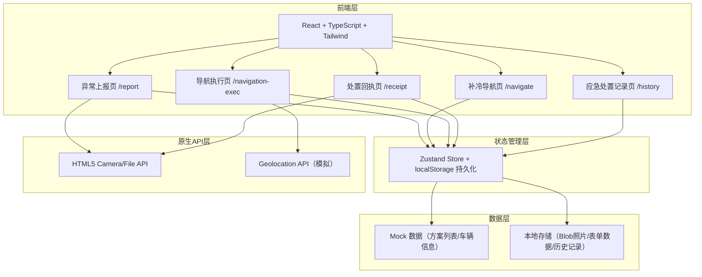
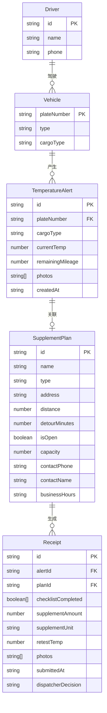

## 1. 架构设计

## 2. 技术说明

- **前端框架**：React@18 + TypeScript + Tailwind CSS@3 + Vite
- **初始化工具**：vite-init（react-ts 模板）
- **路由**：react-router-dom@6
- **状态管理**：Zustand + localStorage 持久化
- **图标库**：lucide-react
- **原生API**：HTML5 File API (capture="environment") 调用相机，Blob URL 预览照片
- **后端**：无（纯前端，Mock 数据模拟）
- **数据库**：localStorage 持久化历史记录

## 3. 路由定义

| 路由 | 用途 |
|------|------|
| `/` | 重定向至异常上报页 |
| `/report` | 异常上报页：车牌选择、货品类型、箱温、里程、真实相机拍照 |
| `/navigate` | 补冷导航页：方案列表、筛选、选择确认 |
| `/navigation-exec` | 导航执行页：模拟导航、预计到达、任务清单整合 |
| `/receipt` | 处置回执页：任务清单、补冷数据、复测温度、智能判断 |
| `/history` | 应急处置记录页：历史上报记录、详情查看 |

## 4. 智能调度判断逻辑

**决策维度**：
1. **温度恢复度**：复测温度 ≤ 安全阈值（根据货品类型）
2. **补冷充分度**：补冷数量 ≥ 建议量（根据温度差计算）
3. **站点可靠性**：合作冷库 > 干冰点 > 制冷剂补给点 > 安全停车区
4. **剩余里程**：剩余里程 ≥ 100km 需更严格判断

**决策矩阵**：
| 温度恢复 | 补冷充分 | 站点类型 | 剩余里程 | 建议结果 |
|----------|----------|----------|----------|----------|
| ✅ 是 | ✅ 是 | 冷库/干冰/制冷剂 | 任意 | 继续运输 |
| ✅ 是 | ❌ 否 | 任意 | < 50km | 继续运输（提示） |
| ✅ 是 | ❌ 否 | 任意 | ≥ 50km | 换车 / 转入冷库 |
| ❌ 否 | ✅ 是 | 冷库 | 任意 | 转入临时冷库 |
| ❌ 否 | ✅ 是 | 干冰/制冷剂 | 任意 | 换车 |
| ❌ 否 | ❌ 否 | 任意 | 任意 | 换车 / 转入冷库 |

## 4. 数据模型（Mock）

### 4.1 数据模型定义

### 4.2 Mock 数据定义

**车辆列表**：
- 京A·88562 / 冷冻肉类
- 京B·33721 / 冷藏蔬果
- 沪C·55019 / 乳制品
- 粤D·66204 / 医药制品

**补冷方案列表**（8个方案）：

| 名称 | 类型 | 距离 | 绕行时间 | 营业 | 容量 | 联系人 |
|------|------|------|----------|------|------|--------|
| 京东冷链干冰站(亦庄) | 干冰点 | 3.2km | 12min | ✅ | 500kg | 张师傅 138****2210 |
| 顺丰冷运补给中心(大兴) | 制冷剂补给点 | 5.8km | 18min | ✅ | 200瓶 | 李主管 139****5521 |
| 中冷物流合作冷库(通州) | 合作冷库 | 8.1km | 25min | ✅ | 50吨 | 王经理 136****8832 |
| 京台高速安全停车区(A3) | 安全停车区 | 1.5km | 5min | ✅ | - | 12122 |
| 华北干冰供应站(朝阳) | 干冰点 | 6.5km | 20min | ❌ | 300kg | 陈师傅 135****4420 |
| 万达冷链补给点(丰台) | 制冷剂补给点 | 4.2km | 15min | ✅ | 150瓶 | 赵主管 137****6633 |
| 首农冷库(房山) | 合作冷库 | 12.3km | 35min | ✅ | 80吨 | 刘经理 133****9911 |
| 京津高速安全停车区(B1) | 安全停车区 | 2.0km | 7min | ✅ | - | 12122 |
